# Improving Shopping Mall Revenue by Real-Time Customized Digital Coupon Issuance

## Overview
This project aims to improve shopping mall revenue by reducing customer churn and increasing purchase conversion rates through real-time customized digital coupon issuance. By analyzing customer behavior, the system generates personalized discount coupons tailored to individual preferences. The goal is to enhance the shopping experience, promote customer loyalty, and maximize sales.

## Technologies Used
- **Java** (for backend development)
- **Servlets** (for request handling)
- **JSP** (for dynamic web pages)
- **JDBC** (for database interaction)
- **SQL** (for managing data in the database)

## Features
- **Real-time Coupon Issuance**: Based on customer behavior and preferences, the system dynamically generates discount coupons.
- **Personalized Discounts**: Coupons are tailored to the individual shopping habits of each customer.
- **Database Integration**: Uses SQL and JDBC to fetch and store customer data.
- **Web Interface**: A user-friendly web interface built using JSP for customers to interact with the system.

## Installation

### Prerequisites
- **Java JDK** (version 8 or higher)
- **Apache Tomcat** (for running Java web applications)
- **MySQL** (for database management)

### Steps to Set Up
1. Clone the repository:
   ```bash
   git clone https://github.com/yourusername/Major-Project.git
2. Navigate to the project folder:
   ```bash
   cd Major-Project
3. Set up the database:
    Import the provided database.sql file into MySQL to create the necessary tables.
4. Configure the database connection:
    Edit the db.properties file to set the correct database URL, username, and password.
5. Deploy the application:
    Deploy the project on Apache Tomcat.

### Usage
- After setting up the application, start the server (Apache Tomcat).
- Open a browser and navigate to http://localhost:8080/YourProjectName.
- Log in to access personalized coupons.

## Snapshots

### Index Page
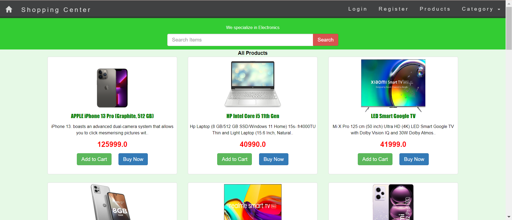

### User Registration Page
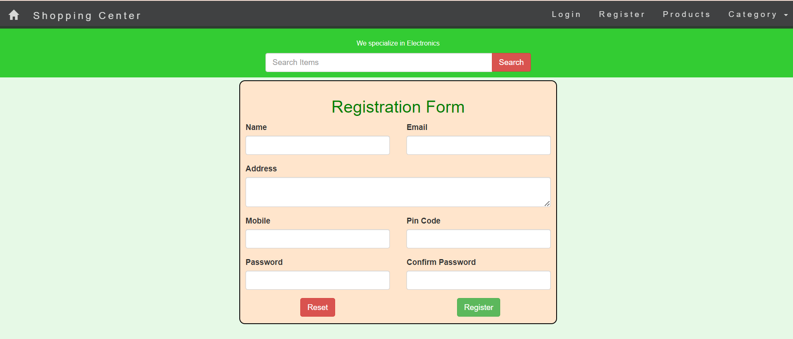

### Login Page
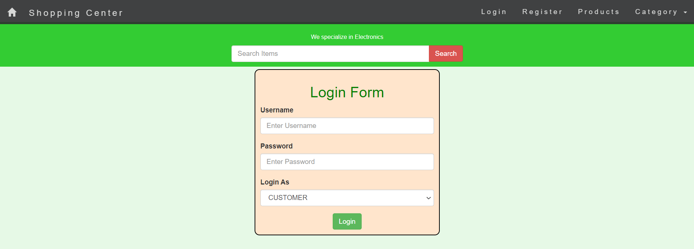

### Cart Page
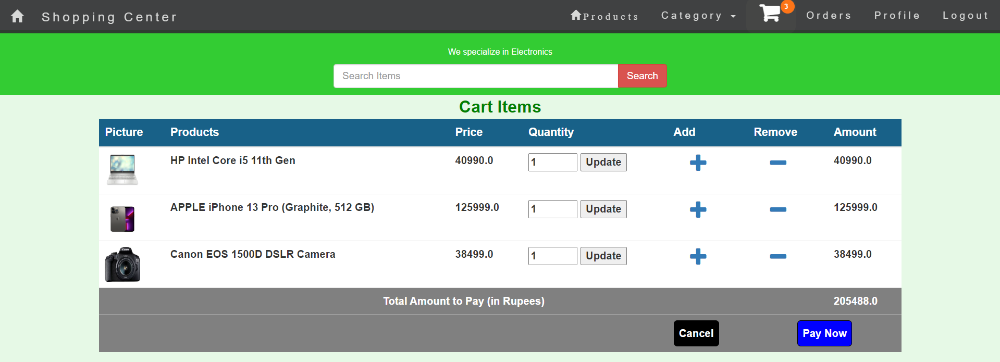

### Payment Page
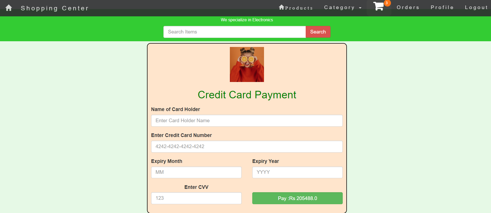

### Order Details
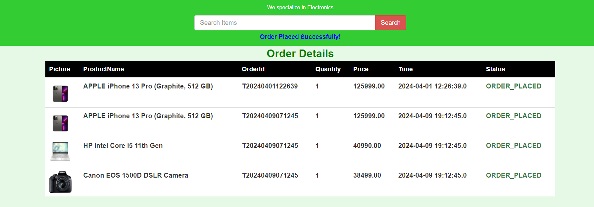

### Profile Page
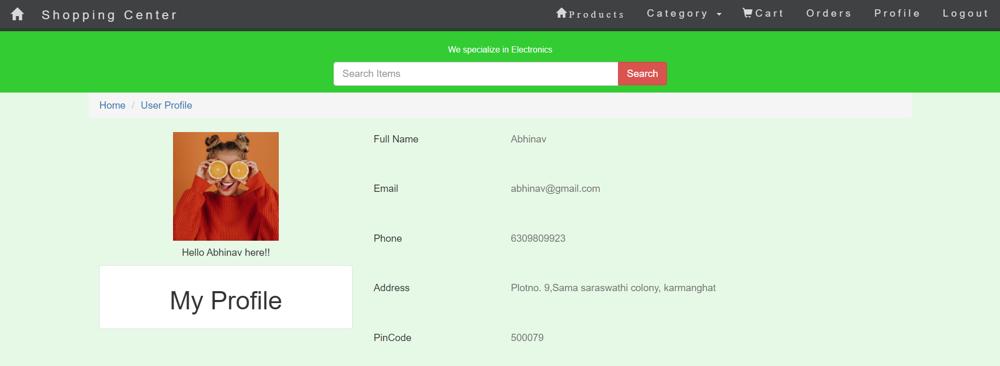

### Admin Login Page
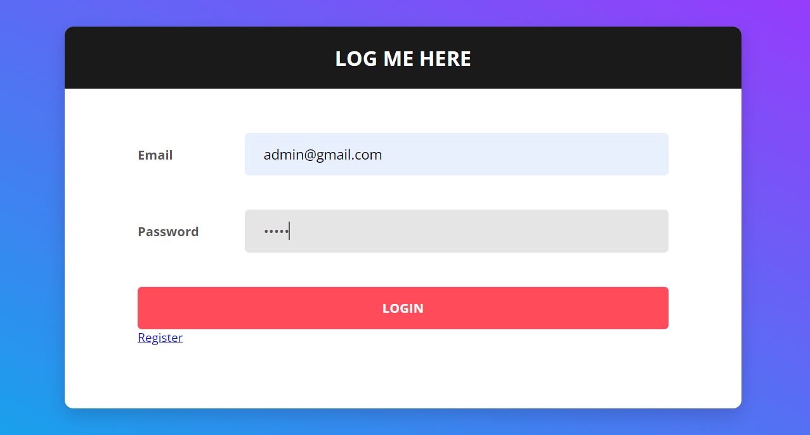

### Admin Home Page
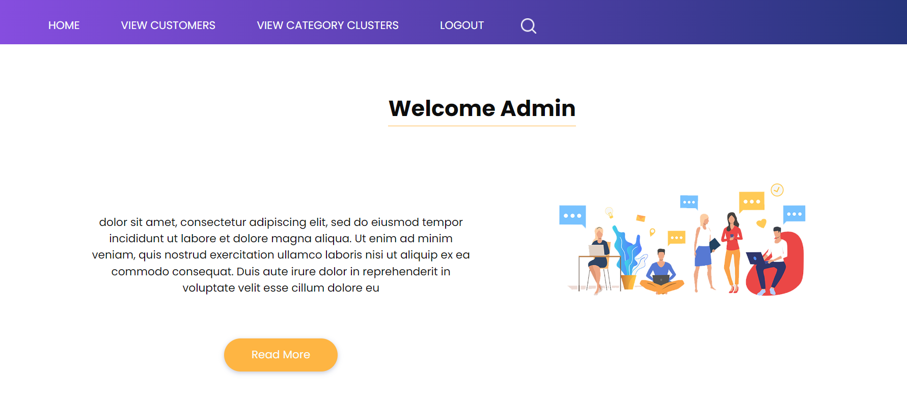

### View Customers Page
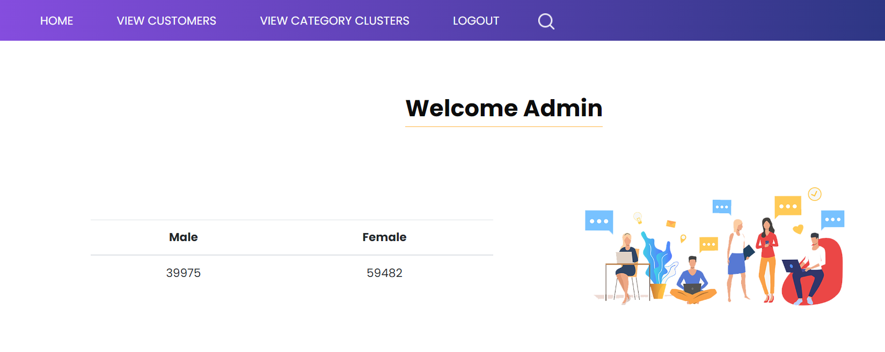

### View Category Clusters Page
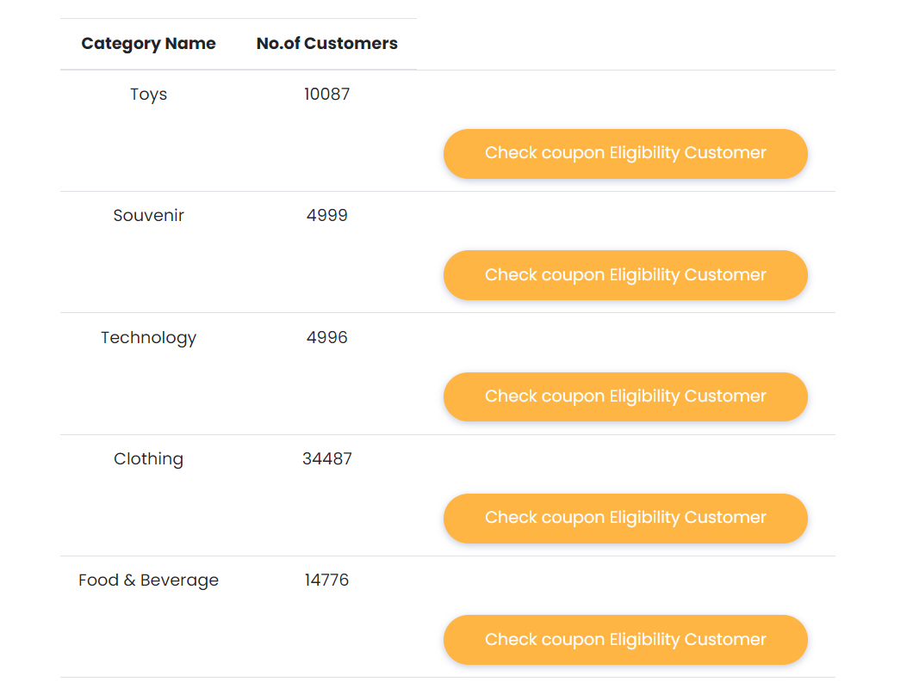

### Customers Eligible for Coupons
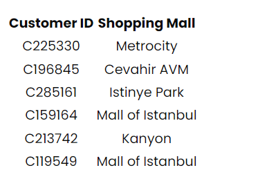


